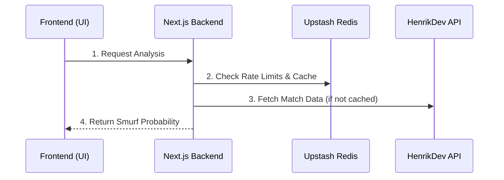

<div align="center">
  <h1 align="center">OmenScan</h1>
  <p align="center"><strong>Advanced Heuristic Anomaly Detection for Valorant</strong></p>
  <p align="center">
    
    
    
    
  </p>
</div>

<br />

## 🎯 The Problem & Solution

**The Problem:** Valorant's native scoreboards don't tell the whole story. When a Level 20 player drops 30 kills in your lobby, are they just having the game of their life, or are they an Immortal smurf ruining the competitive integrity of the match? 

**The Solution:** OmenScan doesn't just display data; it interprets it. By utilizing a multi-variable heuristic engine, OmenScan analyzes the statistical probability of a player operating on an alternate account and exposes hidden anomalies in their match history.

---

## 🧠 The Heuristic Engine (How It Works)

OmenScan doesn't rely on simple K/D ratios. It weighs four key behavioral indicators to generate a highly accurate "Smurf Probability" score:

1. **Lobby ACS Deviation (40% Weight)**  
   *Does this player consistently play like they belong in a higher rank?* OmenScan compares the target player's Average Combat Score (ACS) strictly against the average of the *other 9 players* in that specific lobby.
2. **MVP Consistency (25% Weight)**  
   *Are they hard-carrying every single game?* Analyzes their Match MVP and Team MVP frequency across their last 5 competitive matches.
3. **Account Level Penalty (20% Weight)**  
   *Is this account suspiciously new?* Cross-references low account levels (Level < 40) with massive overperformance. (It explicitly pardons low-level players who perform normally).
4. **The "Rust" Factor (15% Weight)**  
   *Are they too good after taking a break?* Detects if an account hasn't played a competitive match in weeks but instantly returns and drops a 300+ ACS.

---

## 🏗️ System Architecture

OmenScan uses a clean **Backend-For-Frontend (BFF)** architecture to keep API keys hidden and ensure lightning-fast responses.



### 🔒 Security & Performance
- **Rate Limiting:** Protects the external API quota by strictly limiting users to 5 requests per minute using Upstash Redis.
- **Response Caching:** Analyzed profiles are cached in Redis for 10 minutes, dropping repeat-search latency to ~50ms.
- **Strict Validation:** Uses Zod to enforce strict payload shaping and reject malformed requests.

---

## 🛠️ Tech Stack

- **Framework:** Next.js (App Router)
- **Language:** TypeScript
- **Styling:** Tailwind CSS v4 + Shadcn UI
- **Database/Cache:** Upstash Redis
- **Security:** Zod (Validation), @upstash/ratelimit
- **External API:** HenrikDev Unofficial Valorant API

---

## 🚀 Getting Started (Local Development)

To run OmenScan locally, follow these steps:

1. **Clone the repository**
   ```bash
   git clone https://github.com/asperavl/omenscan.git
   cd omenscan
   ```

2. **Install dependencies**
   ```bash
   npm install
   ```

3. **Set up Environment Variables**
   Rename the `.env.example` file to `.env.local` and add your keys:
   ```bash
   # Get an API key from the HenrikDev Discord
   HENRIK_API_KEY=your_henrik_key
   
   # Get Redis keys from console.upstash.com
   UPSTASH_REDIS_REST_URL=your_upstash_url
   UPSTASH_REDIS_REST_TOKEN=your_upstash_token
   ```

4. **Run the development server**
   ```bash
   npm run dev
   ```
   Open [http://localhost:3000](http://localhost:3000) with your browser to see the result.

---

## 📄 License
This project is licensed under the MIT License - see the [LICENSE](LICENSE) file for details.
